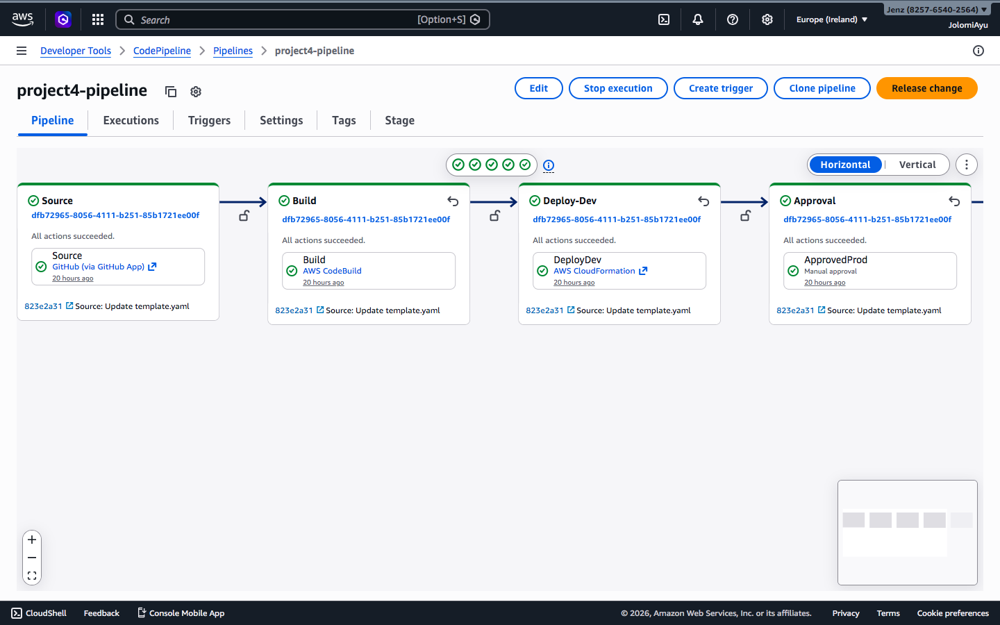
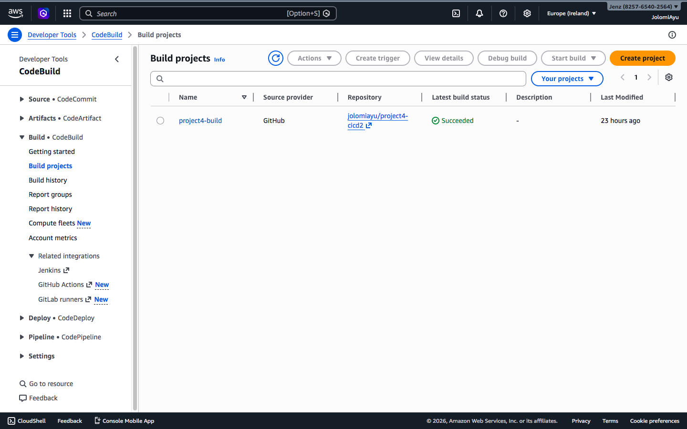
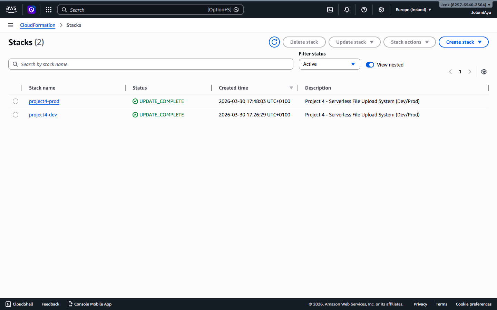
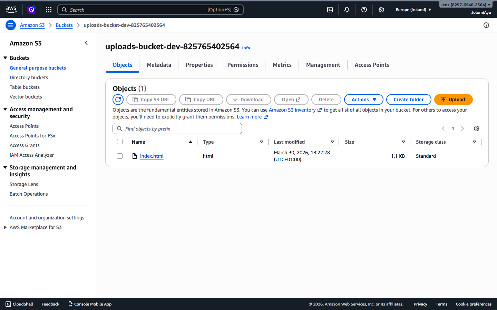
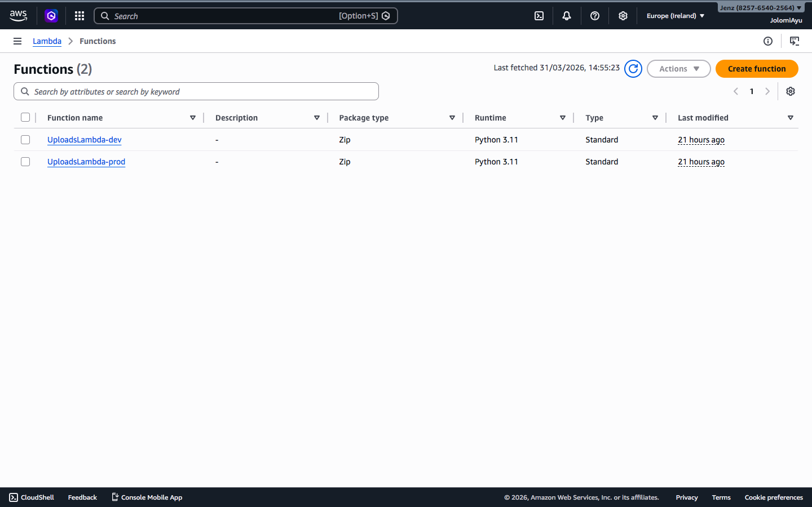
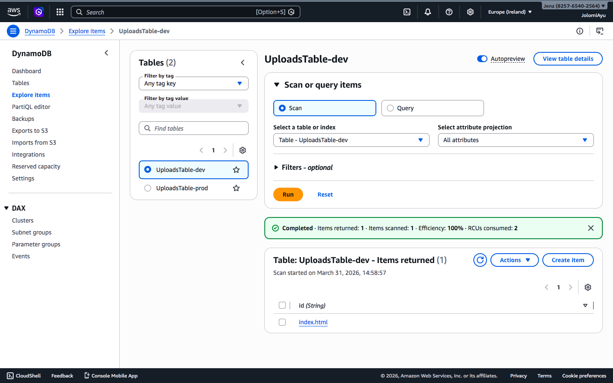

🚀 AWS Serverless CI/CD File Upload System

📌 Overview

This project showcases a fully automated CI/CD pipeline for deploying a serverless file upload system on AWS.

It demonstrates how modern cloud applications are built using Infrastructure as Code (IaC) and event-driven architecture.

---

🏗️ Architecture

The system is built using AWS serverless services:

- Amazon S3 – Stores uploaded files
- AWS Lambda – Processes file uploads
- Amazon DynamoDB – Stores file metadata
- AWS CodePipeline – Automates CI/CD workflow
- AWS CodeBuild – Builds and deploys code
- AWS CloudFormation – Provisions infrastructure

---

⚙️ Workflow

1. Code is pushed to GitHub
2. AWS CodePipeline is triggered
3. AWS CodeBuild executes "buildspec.yml"
4. AWS CloudFormation deploys infrastructure
5. File upload to S3 triggers Lambda
6. Lambda stores metadata in DynamoDB

This follows a typical event-driven serverless architecture widely used in production systems citeturn0search3

---

🛠️ Tech Stack

- AWS CodePipeline
- AWS CodeBuild
- AWS CloudFormation
- AWS Lambda
- Amazon S3
- Amazon DynamoDB

---

📸## 📸 Screenshots

### CodePipeline

### CodeBuild

### CloudFormation

### S3 Bucket

### Lambda Function

### DynamoDB Table

---

📂 Project Structure

project-root/
│── buildspec.yml
│── template.yaml
│── lambda_function.py
│── README.md
│── project-4-screenshots/

---

🎯 Key Features

- Automated CI/CD pipeline
- Infrastructure as Code (CloudFormation)
- Event-driven architecture
- Scalable and cost-efficient system

---

📈 Learning Outcomes

- Built a complete CI/CD pipeline on AWS
- Automated infrastructure deployment
- Integrated multiple AWS services
- Implemented real-world DevOps practices

---

👨‍💻 Author

Jolomi Ayu
Entry-Level AWS Cloud Engineer
